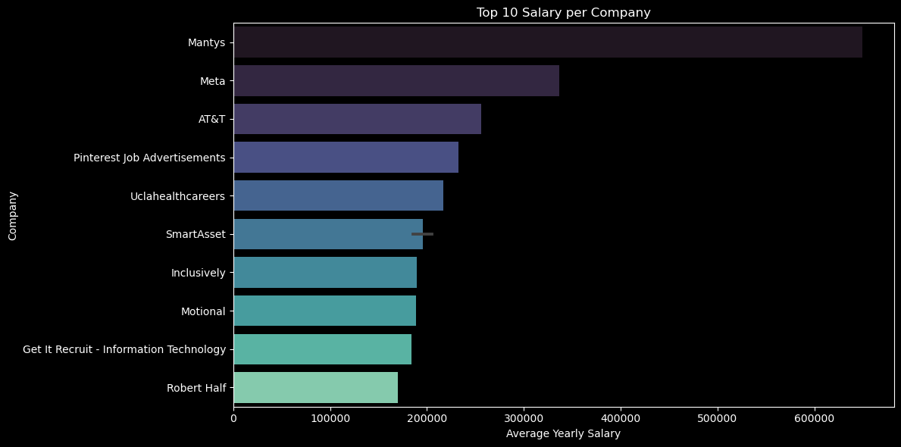
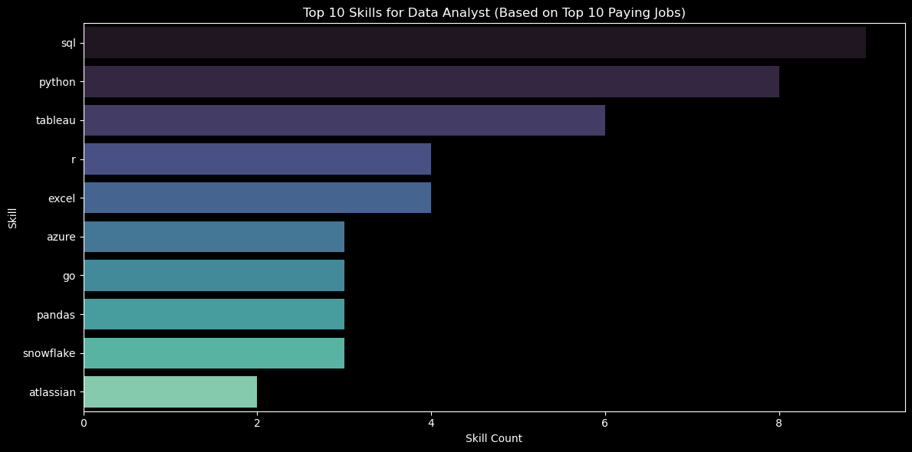
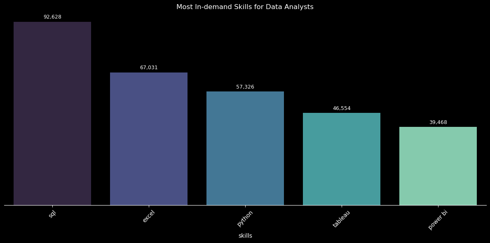
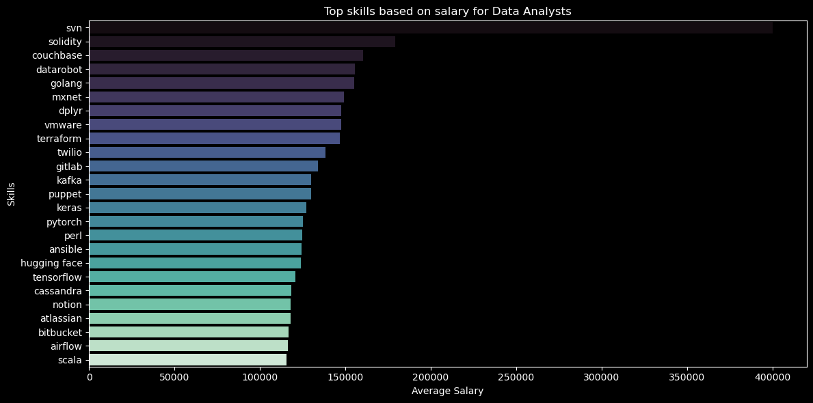
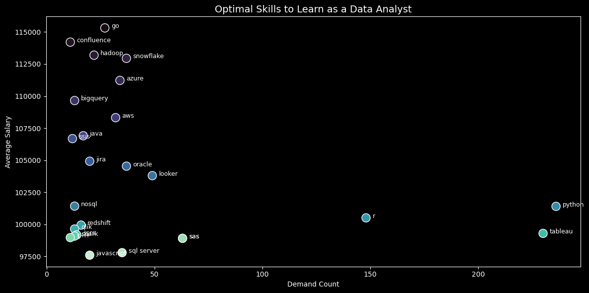

## 📚 Sobre o Projeto
Este repositório foi criado como parte do meu treinamento prático em SQL, seguindo o projeto proposto pelo Luke Barousse no vídeo SQL Project for Beginners | Data Job Analysis.
LINK Curso/Material: https://www.youtube.com/watch?v=7mz73uXD9DA

O objetivo do projeto é explorar e praticar a construção de consultas/queries SQL em um banco de dados relacionado ao mercado de trabalho na área de dados, incluindo vagas para:

- Analistas de Dados (Data Analysts)
- Engenheiros de Dados (Data Engineers)
- Cientistas de Dados (Data Scientists)
- Outros profissionais de tecnologia e dados

## 🛠️ O que foi trabalhado
Ao longo do projeto, foram desenvolvidas habilidades práticas em:

- Treinar habilidade de tornar dados brutos em insights valiosos para tomada de decisão
- Criação de consultas SQL complexas para treinar o domínio da linguagem
- Utilização de cláusulas como SELECT, WHERE, GROUP BY, ORDER BY, JOIN, entre outras
- Criação de subqueries e CTEs (Common Table Expressions)
- Aplicação de filtros para análises específicas (como ano, localidade, tipo de vaga, etc.)
- Git e Github para gestão de alterações e publicação do projeto.

## 📊 Base de Dados
A base de dados contém informações sobre vagas de emprego, incluindo:

- Cargo e título da vaga
- Empresa contratante
- Localização
- Faixa salarial
- Habilidades e tecnologias exigidas
- Tipo de vaga (tempo integral, remoto, presencial, etc.)
- Data de postagem

## 🎯 Objetivo do Treinamento
O foco principal é desenvolver habilidades práticas em SQL, reforçando conceitos fundamentais e preparando para situações do mundo real, como:

- Analisar grandes volumes de dados
- Criar relatórios
- Tomar decisões baseadas em dados extraídos via consultas SQL
- Este projeto não tem fins comerciais — é puramente educacional e voltado para prática pessoal.

Queries executadas durante o treinamento [sql_load](/sql_load/)

- Como plus, exercitei a criação de gráficos utilizando as bibliotecas do Python Matplotlib e Seaborn.

Para acessar clique aqui: [visual](/project_py/visualization.ipynb/)


## 📚 Insights do projeto

### 1. Top Paying Data Analyst Roles
Além de identificar o top10 salários para Analista de Dados realizei filtros de cargo, média salarial e trabalhos remotos visando adequar à minha área de interesse.

``` sql
SELECT
    job_id,
    job_title,
    job_location,
    job_schedule_type,
    salary_year_avg,
    job_posted_date,
    c.name AS company_name
FROM
    job_postings_fact AS j
LEFT JOIN company_dim AS c ON j.company_id = c.company_id
WHERE
    job_title_short = 'Data Analyst' AND
    job_location = 'Anywhere' AND
    salary_year_avg IS NOT NULL
ORDER BY
    salary_year_avg DESC
LIMIT 10;
```
Detalhamento da análise:
-  **Variação:** Top 10 salários de Analista de Dados varia entre $184,000 a $650,000 / ano. Indicando um potencial significativo para esta área.

-  **Diversidade de Empregadores:** Empresas como SmartAsset, Meta, and AT&T estão entre as que pagam os grandes salários. Isso demonstra o interesse mesmo entre diferentes segmentos.

-  **Variedade em nomes de cargos:** Não existe um nome padrão para o título deste cargo. De Analista de Dados até Diretor of Analytics refletem a diversidade de cargos e especialização nesta área.




### 2. Top Paying Data Analyst Skills

``` sql
WITH top_paying_jobs AS (
SELECT
    job_id,
    job_title,
    salary_year_avg,
    name AS company_name
FROM
    job_postings_fact AS j
LEFT JOIN company_dim AS c ON j.company_id = c.company_id
WHERE
    job_title_short = 'Data Analyst' AND
    job_location = 'Anywhere' AND
    salary_year_avg IS NOT NULL
ORDER BY
    salary_year_avg DESC
LIMIT 12
)

SELECT
    top_paying_jobs.*,
    s.skills
FROM top_paying_jobs
INNER JOIN skills_job_dim AS sjd ON top_paying_jobs.job_id = sjd.job_id
INNER JOIN skills_dim AS s ON sjd.skill_id = s.skill_id
ORDER BY
    salary_year_avg DESC;
```

Detalhamento da análise:
-  **Conclusão da Análise:** A habilidade mais requisitada no mercado para altos salários entre analistas de dados é SQL, seguida por Python e Tableau. Surpreendentemente, o Power BI não apareceu entre as mais demandadas, enquanto o Excel continua firmemente entre as 5 principais skills, desafiando as constantes previsões de sua "morte" que circulam há anos.



### 3. Top Demanded Skills

``` sql
SELECT
    skills,
    COUNT(skills_job_dim.job_id) AS demand_count
FROM job_postings_fact
INNER JOIN skills_job_dim ON job_postings_fact.job_id = skills_job_dim.job_id
INNER JOIN skills_dim ON skills_job_dim.skill_id = skills_dim.skill_id
WHERE
    job_title_short = 'Data Analyst'
GROUP BY
    skills
ORDER BY
    demand_count DESC
LIMIT 5;
```
Detalhamento da análise:
-  **Conclusão da Análise:** Olhando para as skills mais deamandadas pelo mercado para analistas de dados, independentemente do salário, podemos perceber ainda a liderança dos conhecimentos em SQL, EXCEL e PYTHON conforme gráfico abaixo. Como ferramentas de visualização temos TABLEU e POWER BI constando como 4º e 5º colocados.



### 4. Top Demanded Skills (High Salary)

``` sql
SELECT
    skills,
    ROUND(AVG(job_postings_fact.salary_year_avg),0) AS avg_salary
FROM job_postings_fact
INNER JOIN skills_job_dim ON job_postings_fact.job_id = skills_job_dim.job_id
INNER JOIN skills_dim ON skills_job_dim.skill_id = skills_dim.skill_id
WHERE
    job_title_short = 'Data Analyst' AND
    salary_year_avg IS NOT NULL
    -- AND job_work_from_home = True --To use whenever you want
GROUP BY
    skills
ORDER BY
    avg_salary DESC
LIMIT 25;
```
Detalhamento da análise:
-  **Nível Elevado para Cargos:** Quando incluimos os maiores salários, temos cargos C'levels contemplados, nível gerencial e outros. Esta visão pode incrementar o planejamento de estudos para focar além do básico requerido de mercado.

-  **Princpais:** No gráfico abaixo podemos verificar as principais skills, as cinco primeiras são - SVN, Solidity, Couchbase, Datarobot e golang. Isso demonstra que é preciso aprofundar em Machine Learning, banco de dados NoSQL e outras linguagens para alcançar os maiores salários.




### 5. Optimal_skills.sql (Salary and Demand)

``` sql
SELECT  
    skills_dim.skill_id,
    skills_dim.skills,
    COUNT(skills_job_dim.job_id) AS demand_count,
    ROUND(AVG(job_postings_fact.salary_year_avg), 0) AS avg_salary
FROM job_postings_fact
INNER JOIN skills_job_dim ON job_postings_fact.job_id = skills_job_dim.job_id
INNER JOIN skills_dim ON skills_job_dim.skill_id = skills_dim.skill_id
WHERE
    job_title_short = 'Data Analyst'
    AND salary_year_avg IS NOT NULL
    AND job_work_from_home = True --To use whenever you want
GROUP BY
    skills_dim.skill_id
HAVING
    COUNT(skills_job_dim.job_id) > 10
ORDER BY
    avg_salary DESC,
    demand_count DESC
LIMIT 25;
```
Detalhamento da análise:
-  **Conclusão:** É possível observar pelo gráfico de dispersão (Scatter Plot) que as habilidades mais requeridas para salários próximos a 100K/ano são: Python, Tableu e R. Enquanto, conforme o salário aumenta as habilidades são mais variadas.
    O top cinco entre habilidades que mais foram requeridas e com maiores salários são: Go, Confluence, Hadoop, Snowflake e Azure.



